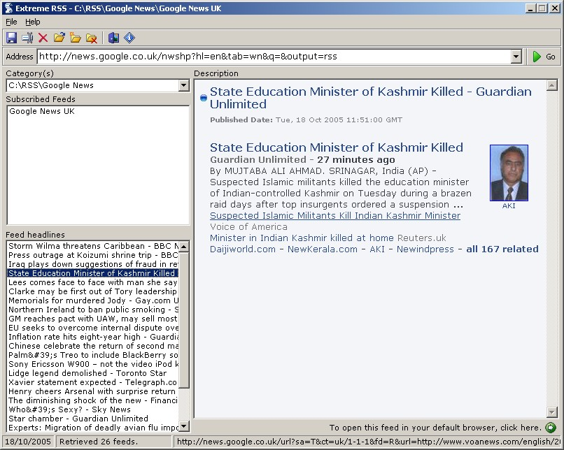



## ExtremeRSS

### Description

Simple RSS reader, reads the most comon feeds. Not tested with all.
 
### More Info
 

             |
---                |---
**Submitted On**   |2005-09-17 12:36:44
**By**             |[Martin Dunsmore](https://github.com/Planet-Source-Code/PSCIndex/blob/master/ByAuthor/martin-dunsmore.md)
**Level**          |Intermediate
**User Rating**    |5.0 (30 globes from 6 users)
**Compatibility**  |VB 5\.0, VB 6\.0
**Category**       |[Internet/ HTML](https://github.com/Planet-Source-Code/PSCIndex/blob/master/ByCategory/internet-html__1-34.md)
**World**          |[Visual Basic](https://github.com/Planet-Source-Code/PSCIndex/blob/master/ByWorld/visual-basic.md)
**Archive File**   |[ExtremeRSS19413910182005\.zip](https://github.com/Planet-Source-Code/martin-dunsmore-extremerss__1-62940/archive/master.zip)

